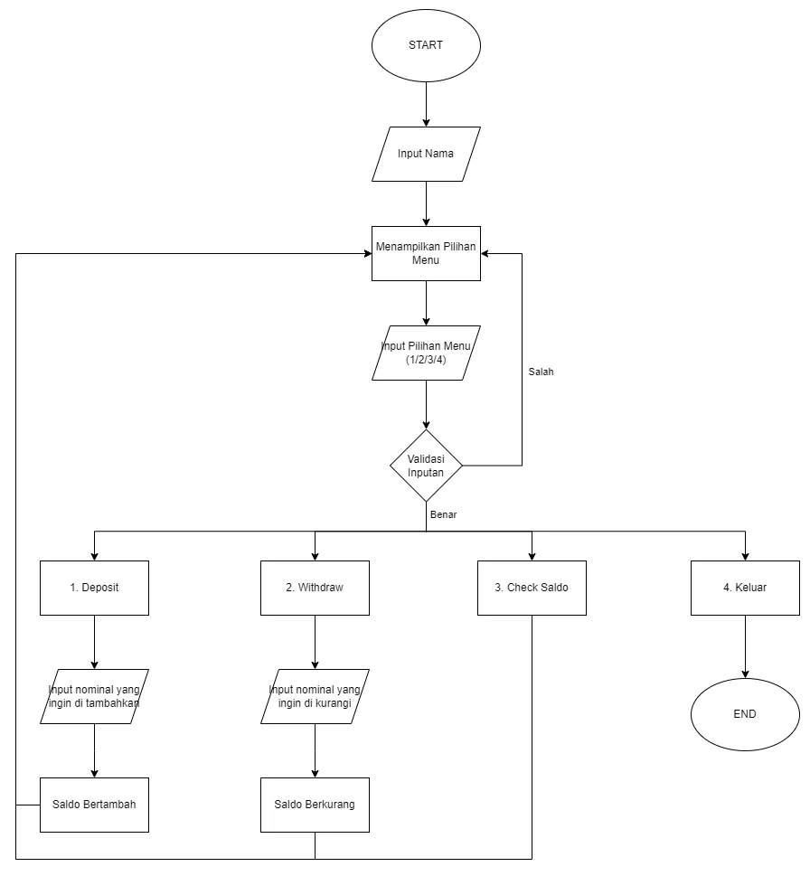
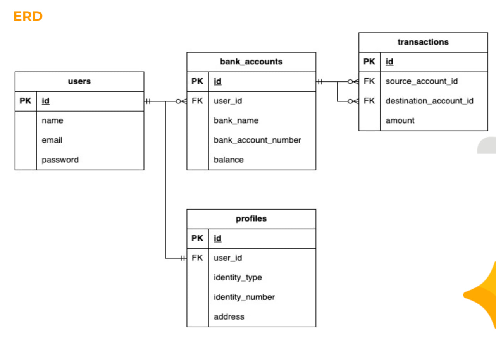

# Binar Challenge Chapter 2 - Basic Banking System

Studi Kasus Challenge 2
Dalam studi kasus ini, kita akan membuat sebuah Basic Banking System sederhana menggunakan konsep Pemrograman Berorientasi Objek (OOP) dan mensimulasikan operasi transaksi yang asynchronous.

Flowchart


ERD


List Endpoints
○ POST /api/v1/users => menambahkan user baru beserta dengan profilnya.
○ GET /api/v1/users => menampilkan daftar users.
○ GET /api/v1/users/:userId => menampilkan detail informasi user (tampilkan juga profilnya).
○ POST /api/v1/accounts => menambahkan akun baru ke user yang sudah didaftarkan.
○ GET /api/v1/accounts => menampilkan daftar akun.
○ GET /api/v1/accounts/:accountId => menampilkan detail akun.
○ POST /api/v1/transactions => mengirimkan uang dari 1 akun ke akun lain (tentukan request body nya).
○ GET /api/v1/transactions => menampilkan daftar transaksi.
○ GET /api/v1/transactions/:transactionId => menampilkan detail transaksi (tampilkan juga pengirim dan penerimanya).

Langkah Penggunaan:
1. Pastikan di local komputer telah terinstall nodejs, dan git
2. Clone repositori project dengan perintah ```git clone https://github.com/fajrCode/F-BEE24001186-km7-faj-basic-banking-system-ch2.git```
3. Pindah ke direktori yang telah di clone dengan perintah ```cd F-BEE24001186-km7-faj-basic-banking-system-ch2.git```
4. Buka project dengan code editormu, jika menggunakan vscode bisa menggunakan perintah ```code .```
5. Kemudian buka terminal melalui dan jalan kan perintah ```npm install``` untuk menginstall package yang digunakan di project ini.
6. Jangan lupa untuk merename folder .env-example menjadi .env dan sesuaikan dengan environment yang kamu miliki.
7. Buat database baru dengan nama yang sama dengan yang kamu buat di .env
8. Jalankan perintah ```npx prisma migrate dev --name clone```
9. Lalu jalankan server ```npm run dev```
10. Selesai.
11. Happy coding (❁´◡`❁)