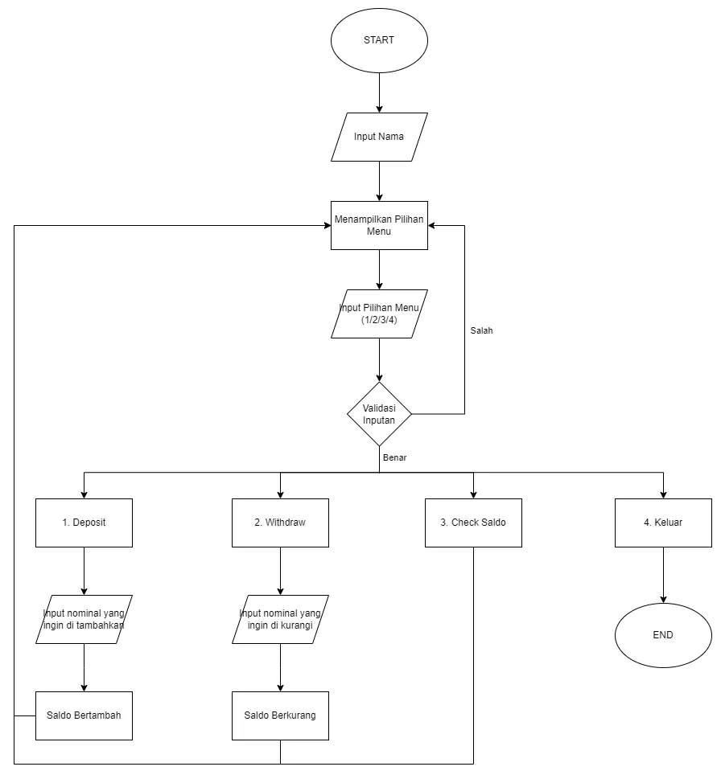
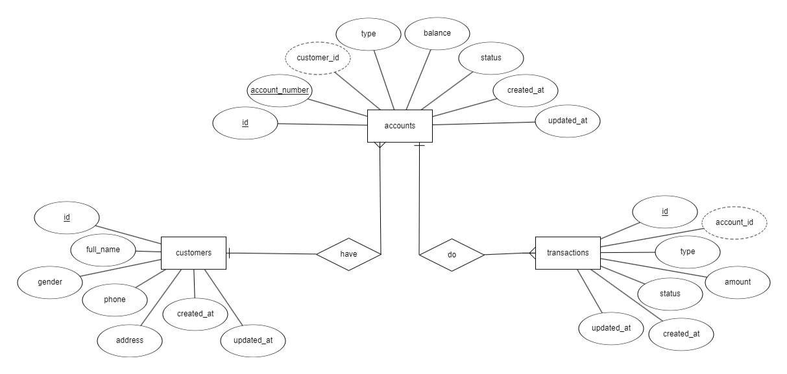

# Binar Challenge Chapter 2 - Basic Banking System

Studi Kasus Challenge 2
Dalam studi kasus ini, kita akan membuat sebuah Basic Banking System sederhana menggunakan konsep Pemrograman Berorientasi Objek (OOP) dan mensimulasikan operasi transaksi yang asynchronous.

Flowchart


ERD


Langkah Penggunaan:
1. Pastikan di local komputer telah terinstall nodejs, dan git
2. Clone repositori project dengan perintah ```git clone https://github.com/fajrCode/F-BEE24001186-km7-faj-basic-banking-system-ch2.git```
3. Pindah ke direktori yang telah di clone dengan perintah ```cd F-BEE24001186-km7-faj-basic-banking-system-ch2.git```
4. Buka project dengan code editormu, jika menggunakan vscode bisa menggunakan perintah ```code .```
5. Kemudian buka terminal melalui dan jalan kan perintah ```node bank_system.js```
6. Lalu akan muncul perintah untuk menginputkan nama anda.
7. Setelah nama di inputkan, maka akan tampil menu utama dari sistem yang berisi 4 pilihan. Inputkan nomor dari menu yang dipilihkan.
8. Ikuti perintah setelah memilih menu.
7. Selesai.
8. Happy coding (❁´◡`❁)