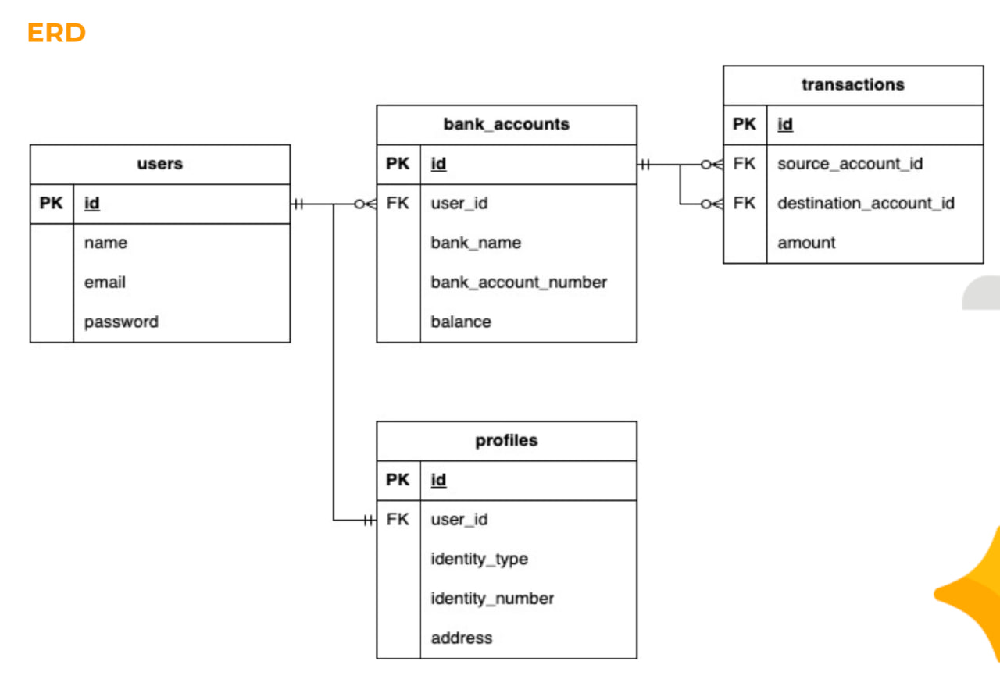
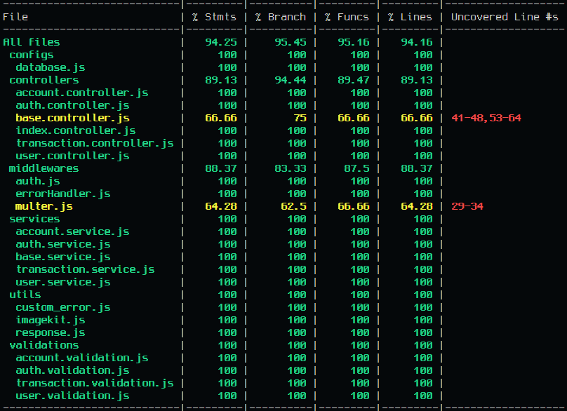
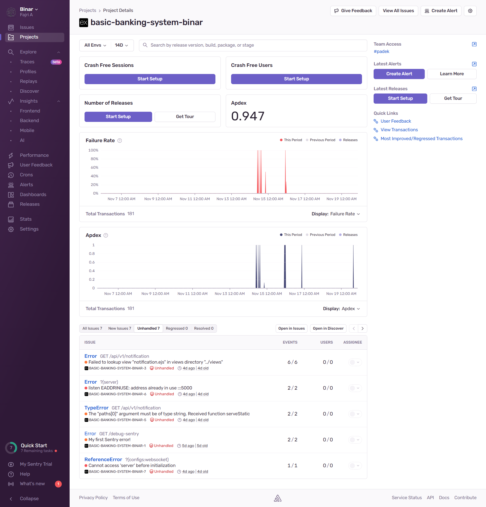

# Binar Challenge - Test Case Basic Banking System
---
## Description
Studi Kasus Challenge 4 Binar Backend Javascripts. Dalam studi kasus ini, kita akan mengintegrasikan sebuah Basic Banking System sederhana menggunakan Express.js dan Prisma.js.

### Flowchart


### ERD


### Coverage

[Codecov Coverage Test](https://app.codecov.io/github/fajrCode/F-BEE24001186-km7-faj-basic-banking-system-ch2/tree/dev/src%2Fcontrollers)

### Sentry


## List Endpoints
- POST /api/v1/users => menambahkan user baru beserta dengan profilnya.
- GET /api/v1/users => menampilkan daftar users.
- GET /api/v1/users/:userId => menampilkan detail informasi user (tampilkan juga profilnya).
- PATCH /api/v1/users/:userId => melakukan update data users beserta profilenya.
- PATCH /api/v1/users/upload/profile-image => melakukan update foto profile user.
- POST /api/v1/accounts => menambahkan akun baru ke user yang sudah didaftarkan.
- GET /api/v1/accounts => menampilkan daftar akun.
- GET /api/v1/accounts/:accountId => menampilkan detail akun.
- POST /api/v1/transactions => mengirimkan uang dari 1 akun ke akun lain (tentukan request body nya).
- GET /api/v1/transactions => menampilkan daftar transaksi.
- GET /api/v1/transactions/:transactionId => menampilkan detail transaksi (tampilkan juga pengirim dan penerimanya).
- DELETE /api/v1/transactions/:transactionId => menghapus data transaksi berdasarkan ID transaksi dan refund balance ke bank account.
- POST /api/v1/auth/login => melakukan authentikasi login
- POST /api/v1/auth/register => melakukan registrasi user baru
- GET /api/v1/auth/authenticate => melakukan pengecekan authentikasi, dengan return data user yang login
- GET /api/v1/docs => menampilkan dokumentasi api
- GET / => View Homepage. (NEW !!!)
- GET /api/v1/notification => View Notification for triger forgot and reset password. (NEW !!!)
- POST /api/v1/auth/forgot-password/:token => Api for sending email reset password. (NEW !!!)
- POST /api/v1/auth/reset-password => Api for reset password. (NEW !!!)

## Prerequisites
- NodeJS V^16
- PostgreSQL V^16

## How To Use
1. Pastikan di local komputer telah terinstall nodejs, dan git
2. Clone repositori project dengan perintah ```git clone https://github.com/fajrCode/F-BEE24001186-km7-faj-basic-banking-system-ch2.git```
3. Pindah ke direktori yang telah di clone dengan perintah ```cd F-BEE24001186-km7-faj-basic-banking-system-ch2.git```
4. Buka project dengan code editormu, jika menggunakan vscode bisa menggunakan perintah ```code .```
5. Kemudian buka terminal melalui dan jalan kan perintah ```npm install``` untuk menginstall package yang digunakan di project ini.
6. Jangan lupa untuk merename folder .env-example menjadi .env dan sesuaikan dengan environment yang kamu miliki.
7. Buat database baru dengan nama yang sama dengan yang kamu buat di .env
8. Jalankan perintah ```npx prisma migrate dev --name clone```

## How To Run

### Running Project
```npm run start``` or ```pnpm start```

### Running Development Mode
```npm run dev``` or ```pnpm dev```

---
Happy coding (❁´◡`❁)